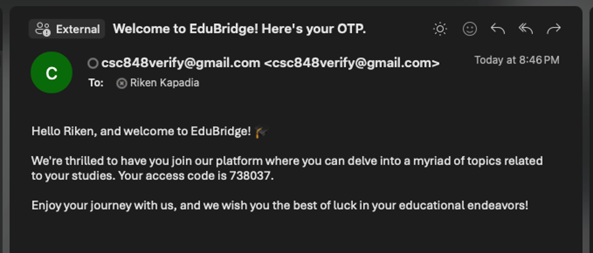
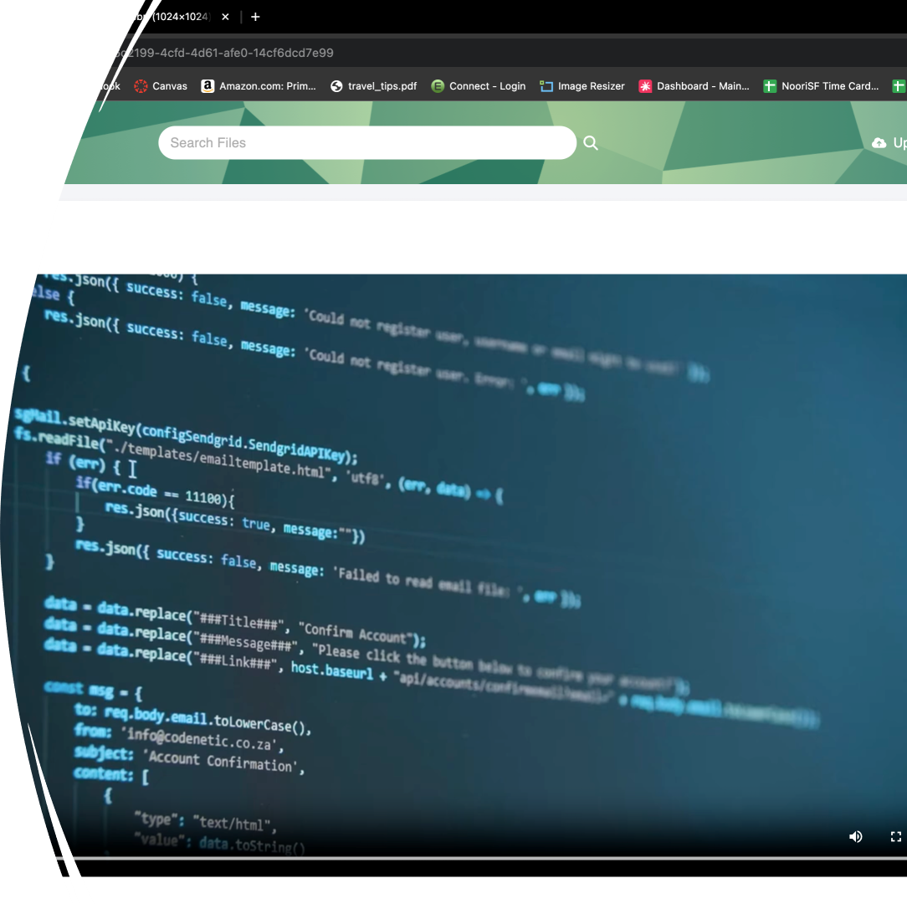

# EduBridge
#  

EduBridge is a modern learning platform designed to enhance the online education experience by bridging the gap between educators and students. Our platform focuses on delivering quality education with active participation and rewards for both instructors and students.

## Table of Contents

- [Key Features](#key-features)
- [Technologies Used](#technologies-used)
- [Project Structure](#project-structure)
- [Setup and Deployment](#setup-and-deployment)
- [Backend Integration](#backend-integration)
- [Frontend Deployment](#frontend-deployment)
- [Domain and SSL Setup](#domain-and-ssl-setup)
- [Security](#security)
- [Team](#team)
- [Contributing](#contributing)
- [License](#license)

## Key Features

- **Ad-Free Environment**: EduBridge offers an uninterrupted learning environment free from advertisements.
- **Organized Courses**: Courses are well-organized, making it easier for students to follow and for instructors to organize their materials.
- **Offline Access**: Users can download videos and access them offline, ensuring learning is not interrupted by connection issues.
- **Easy Navigation**: Users can quickly find specific topics, courses, or resources.
- **User Management**: Users can register, log in, and have roles such as admin, student, and instructor.
- **Content Upload and Playback**: Instructors can upload various types of content, and users can view or download these files.
- **Discussion and Feedback**: Users can engage in discussions, post comments, and search for topics.

## Screenshots

### Login Page


### Authentication


### Playback


### Discussions


## Technologies Used

- **Frontend**: React
- **Backend**: Node.js, Express
- **Database**: MySQL
- **CMS**: Directus
- **Email Service**: Nodemailer
- **Deployment**: AWS EC2, Netlify
- **Domain Management**: DuckDNS
- **Web Server and SSL**: Nginx, Certbot


## Setup and Deployment

### Backend Integration

1. **Install Dependencies**: Navigate to the `backend` directory and install dependencies.
    ```bash
    cd backend
    npm install
    ```

2. **Environment Variables**: Update the configuration settings for the database, Directus CMS, and email service in the respective files located in the `services` directory:
    - MySQL configuration: `services/database.js`
    - Directus CMS configuration: `services/directus.js`
    - Nodemailer configuration: `services/emailService.js`

3. **Start the Server**: Start the backend server.
    ```bash
    npm start
    ```

### Frontend Deployment

1. **Install Dependencies**: Navigate to the `frontend` directory and install dependencies.
    ```bash
    cd frontend/sw-engg/
    npm install
    ```

2. **Build the Project**: Build the project for production.
    ```bash
    npm run build
    ```

3. **Deploy to Netlify**: Follow the steps on the Netlify dashboard to deploy your frontend.

### Domain and SSL Setup

1. **Domain with DuckDNS**:
    - Create an account on DuckDNS and set up your domain name.
    - Update your domain's IP address to point to your AWS EC2 instance.

2. **Nginx and Certbot**:
    - Install Nginx on your EC2 instance.
    - Configure Nginx to reverse proxy HTTPS requests to HTTP.
    - Install Certbot and obtain an SSL certificate for your domain.
    - Configure Nginx to use the SSL certificate.

    ```nginx
    server {
        listen 80;
        server_name yourdomain.duckdns.org;

        location / {
            proxy_pass http://localhost:3000;
            proxy_set_header Host $host;
            proxy_set_header X-Real-IP $remote_addr;
            proxy_set_header X-Forwarded-For $proxy_add_x_forwarded_for;
            proxy_set_header X-Forwarded-Proto $scheme;
        }
    }

    server {
        listen 443 ssl;
        server_name yourdomain.duckdns.org;

        ssl_certificate /etc/letsencrypt/live/yourdomain.duckdns.org/fullchain.pem;
        ssl_certificate_key /etc/letsencrypt/live/yourdomain.duckdns.org/privkey.pem;
        include /etc/letsencrypt/options-ssl-nginx.conf;
        ssl_dhparam /etc/letsencrypt/ssl-dhparams.pem;

        location / {
            proxy_pass http://localhost:3000;
            proxy_set_header Host $host;
            proxy_set_header X-Real-IP $remote_addr;
            proxy_set_header X-Forwarded-For $proxy_add_x_forwarded_for;
            proxy_set_header X-Forwarded-Proto $scheme;
        }
    }
    ```

## Security

EduBridge prioritizes the security and privacy of its users. Our platform uses HTTPS for all communications, ensuring data is encrypted and secure. Additionally, as an extra layer of protection, an OTP (One-Time Password) is sent to users the first time they log in to verify their email address.

## Team

- **Naisarg Halvadiya** - Team Lead
- **Shail Patel** - Backend Lead
- **Riken Kapadia** - GitHub Master
- **Dylan Nguyen** - Scrum Master I
- **James Dixon** - Scrum Master II
- **Pankuri Khare** - Frontend Lead

